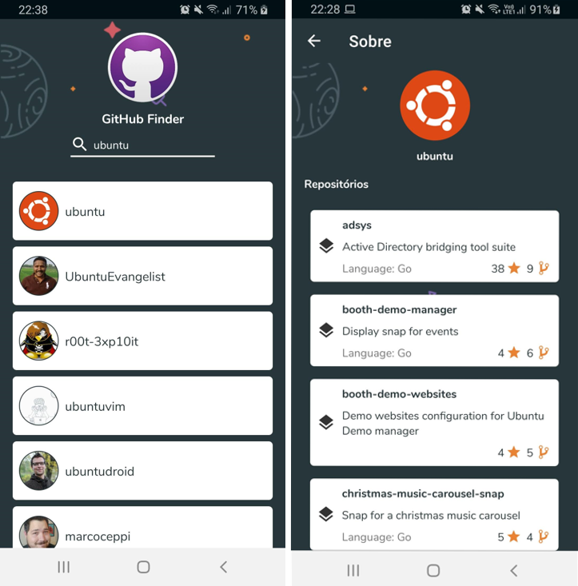

<div align=center margin= auto> 
  
</div>
<h2 align="center"> GitHub Finder </h2>
<p align=center>Aplicativo Android para exibir informações básicas de usuários do <a href="https://github.com/">GitHub.</a></p>

---

</br>
<div align=center margin= auto> 
  
</div>

## Por que?

Este projeto faz parte do meu portfólio pessoal. Eu realmente ficaria feliz com qualquer feedback a respeito do código, estrutura, ou qualquer coisa que possa me tornar um desenvolvedor melhor.

Conecte-se comigo no [LinkedIn](www.linkedin.com/in/bryan-leite-dos-santos).

Fique a vontade para usar este projeto da forma como desejar, seja para estudo ou para propor suas próprias melhorias.


## Funcionalidades

- Procurar usuários pelo 'username' da plataforma
- Descobrir os repositórios públicos destes usuários, com informações de: descrição, número de estrelas, forks, data de criação e issues abertas/fechadas.
- Visitar a página web do perfil

## Instruções de uso

### Pré-requisitos

Para rodar este projeto em modo de desenvolvimento, será necessário que você tenha o ambiente básico para aplicações android utilizando o Android Studio. Essas informações podem ser encontradas [aqui](https://developer.android.com/training/basics/firstapp/running-app).

### Instalação

**Clone este repositório**

```
$ git clone https://github.com/bryanlds/github-finder-android.git

$ cd github-finder-android
```

Importe o projeto para o Android Studio e aguarde o Gradle baixar as dependências.

## Tecnologias

- Linguagem adotada: [**Kotlin**](https://kotlinlang.org/)
- [API do GitHub](https://developer.github.com/v3/)
- Uma arquitetura de atividade única, usando o componente [Navigation](https://developer.android.com/guide/navigation/navigation-getting-started) para gerenciar operações de fragmento
- Camada de apresentação que contém um fragmento (View) e um [ViewModel](https://developer.android.com/topic/libraries/architecture/viewmodel) por tela
- [Live Data](https://developer.android.com/topic/libraries/architecture/livedata?hl=pt-br)
- [Data Binding](https://developer.android.com/topic/libraries/data-binding)
- Suporta mudanças de orientação das telas sem perder estado
- [Constraint Layout](https://developer.android.com/training/constraint-layout)
- [Groupie](https://github.com/lisawray/groupie) - RecyclerView
- [Retrofit](https://square.github.io/retrofit/) - cliente HTTP
- [CircleImageView](https://github.com/hdodenhof/CircleImageView) - _'A fast circular ImageView perfect for profile images'_
- [Picasso](https://github.com/square/picasso) - download e cache de imagens

## Observações

- Apenas 30 resultados são exibidos por vez a cada requisição (busca), por conta da paginação da API.

## Licença

Este projeto está [licenciado](https://github.com/bryanlds/github-finder-android/blob/master/LICENSE) sob a licença MIT.
